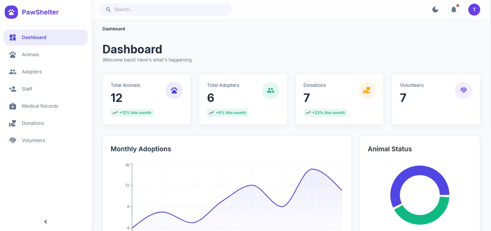

# Sanket Kumar Kar - Portfolio

Welcome to my personal portfolio repository! This is a modern, interactive, and fully responsive portfolio website built to showcase my skills, projects, and achievements as a Full-Stack Developer & AI Engineer.

 <!-- Update with actual hero screenshot if you have one -->

## 🚀 Live Demo

[Visit my Portfolio (Insert Link Here)](https://your-portfolio-link.vercel.app)

## ✨ Features

- **Modern Glassmorphism UI:** Stunning glass-effect cards and immersive backgrounds.
- **Smooth Animations:** Powered by Framer Motion, featuring scroll-triggered reveals, rotating text gradients, and infinite marquee carousels.
- **Fully Responsive:** Optimized for desktops, tablets, and mobile devices.
- **Working Contact Form:** Integrated with EmailJS to send messages directly from the website without a backend server.
- **Project Showcases:** Detailed grid layouts for featured MERN/PERN stack projects.

## 🛠️ Tech Stack

- **Frontend Framework:** React 19 (via Vite)
- **Language:** TypeScript
- **Styling:** Tailwind CSS v4
- **Animations:** Framer Motion (`motion/react`)
- **Icons:** Lucide React
- **Form Handling:** EmailJS (@emailjs/browser)
- **Smooth Scrolling:** Lenis

## 💻 Getting Started

Follow these instructions to run the project locally.

### Prerequisites

- Node.js (v18 or higher)
- npm or yarn

### Installation

1. **Clone the repository:**
   ```bash
   git clone https://github.com/SanketKumarKar/Portfolio.git
   cd Portfolio
   ```

2. **Install dependencies:**
   ```bash
   npm install
   ```

3. **Set up Environment Variables (for EmailJS):**
   *(Optional, depending on if you move your public key to an environment variable)*
   Create a `.env` file in the root directory and add:
   ```env
   VITE_EMAILJS_PUBLIC_KEY=your_public_key
   ```

4. **Run the development server:**
   ```bash
   npm run dev
   ```

5. **Build for production:**
   ```bash
   npm run build
   ```

## 📬 Contact

Feel free to reach out to me!
- **Email:** [sanketkumarkar@gmail.com](mailto:sanketkumarkar@gmail.com)
- **LinkedIn:** [linkedin.com/in/sanketkumarkar](https://linkedin.com/in/sanketkumarkar)
- **GitHub:** [github.com/SanketKumarKar](https://github.com/SanketKumarKar)

---
*Designed & Built with ❤️ by Sanket Kumar Kar*
